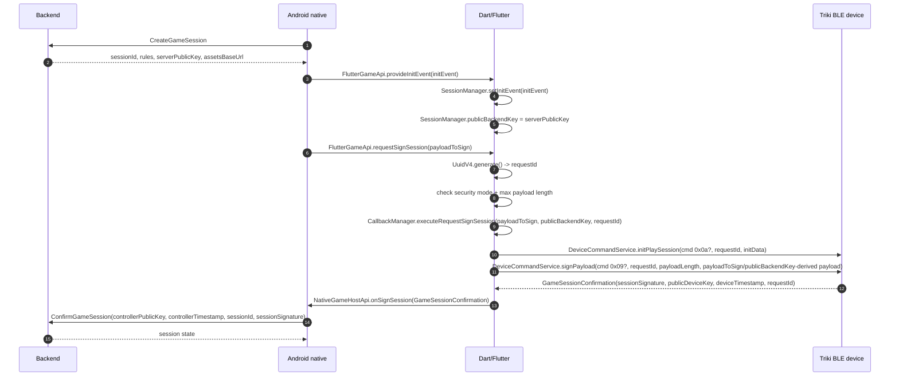
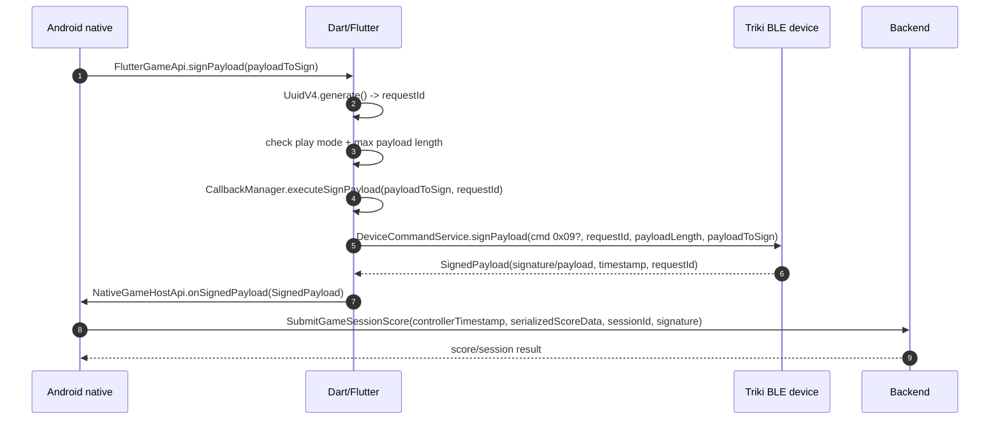
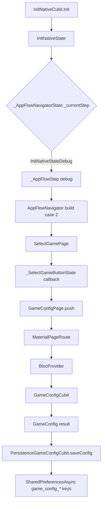

# Triki BLE protocol notes

This document collects the Triki-related BLE findings recovered from the arm64 Flutter/Dart AOT APK split.

Primary recovered files:

- `app-v8/re/blutter-selected/capsapps_sdk/bluetooth/service/device/device_command_service.dart`
- `app-v8/re/blutter-selected/capsapps_sdk/core/shared/configuration/live_measurement_config.dart`
- `app-v8/re/blutter-selected/capsapps_sdk/bluetooth/infrastructure/utils/measurement_decoder.dart`
- `app-v8/re/blutter-selected/flutter_native_api_plugin/src/services/flutter_native_api.dart`
- `app-v8/re/blutter-selected/flutter_native_api_plugin/src/services/callback_manager.dart`
- `app-v8/re/blutter-selected/flutter_native_api_plugin/src/services/session_manager.dart`

Full Blutter output remains in `/tmp/blutter-out-zabka-v8`.

## Caveat: Dart Smi immediates

Several byte literals in the AOT assembly are stored into Dart `List<int>` as tagged small integers. For those immediates the raw value in the assembly is usually `dart_int << 1`.

Examples:

- raw `0x40` in a `List<int>` store is likely Dart int `0x20`
- raw `0x20` is likely Dart int `0x10`
- raw `0x14` is likely Dart int `0x0a`
- raw `0x12` is likely Dart int `0x09`

Object-pool lists shown by Blutter as `List<int>(...) [0xd0, 0x07]` are already decoded and should not be halved again.

Runtime BLE sniffing is still the best way to confirm all command bytes.

## Services and characteristics

Recovered from `DeviceCommandService`.

| Purpose | UUID | Access pattern |
| --- | --- | --- |
| UART/NUS service | `6E400001-B5A3-F393-E0A9-E50E24DCCA9E` | service |
| RX command characteristic | `6E400002-B5A3-F393-E0A9-E50E24DCCA9E` | write without response |
| LED state characteristic | `6E400004-B5A3-F393-E0A9-E50E24DCCA9E` | write with response |
| Device Information service | `180A` | service |
| Firmware Revision String | `2A26` | read |
| Battery service | `180F` | service |
| Battery Level | `2A19` | read |

The app uses Nordic-UART-like UUIDs for commands and a separate `6E400004...` characteristic for LED state.

## Device metadata

### Firmware version

Method: `DeviceCommandService::getFirmwareVersionString`

Reads:

- service `180A`
- characteristic `2A26`

Failures map to `GetFirmwareVersionException`.

The host toolkit also reads this characteristic directly from Android BLE and
prints both decoded UTF-8 and raw bytes on screen:

```text
firmware version: <string> status=<gatt-status> hex=<raw 2A26 bytes>
```

This is independent of the Flutter firmware gate. In the patched host build the
gate itself is bypassed by forcing `FirmwareUpdateService._classifyDeviceVersion`
to return `FirmwareState.firmwareSupported`, but the toolkit read still shows
the physical Triki firmware revision reported by the device.

### Battery level

Method: `DeviceCommandService::getBatteryLevel`

Reads:

- service `180F`
- characteristic `2A19`

Failures map to `ReadBatteryException`.

## LED control

High-level call chain:

- `CapsAppsSdk::setLedOff(deviceId)` calls `BluetoothService::sendLedStateCommand(deviceId, 0)`
- `CapsAppsSdk::setLedOn(deviceId)` calls `BluetoothService::sendLedStateCommand(deviceId, 1)`
- `DeviceCommandService::sendLedStateCommand` writes one byte to LED characteristic with response

Characteristic:

- service: `6E400001-B5A3-F393-E0A9-E50E24DCCA9E`
- characteristic: `6E400004-B5A3-F393-E0A9-E50E24DCCA9E`
- write mode: with response

Commands:

```text
00  # LED off
01  # LED on
```

## Live measurement streaming

Streaming commands write to RX:

- service: `6E400001-B5A3-F393-E0A9-E50E24DCCA9E`
- characteristic: `6E400002-B5A3-F393-E0A9-E50E24DCCA9E`
- write mode: without response

### Start streaming

Builder: `LiveMeasurementConfig::startLiveMeasurementRequestData(config)`

Packet shape:

```text
20 10 00 d0 07 <sensor-enable-flag...> <odr...>
```

For the default `accelerometerAndGyroscope + Freq104Hz` config:

```text
20 10 00 d0 07 03 68 00
```

Recovered construction:

- raw AOT immediates `0x40 0x20 0x00` decode to Dart ints `0x20 0x10 0x00`
- then object-pool constant `List<int>(2) [0xd0, 0x07]`
- then `SensorsEnableFlag.field_14`
- then `SensorsFrequencyOdr.field_14`

### Stop streaming

Builder: `LiveMeasurementConfig::stopLiveMeasurementRequestData()`

Packet:

```text
20 00 00 00 00
```

Recovered construction:

- raw AOT immediate `0x40` decodes to Dart int `0x20`
- then zeros

## Sensor flags and ODR values

Recovered enum objects:

| Name | Bytes |
| --- | --- |
| `SensorsEnableFlag.accelerometer` | `01` |
| `SensorsEnableFlag.accelerometerAndGyroscope` | `03` |
| `SensorsFrequencyOdr.Freq12Hz` | `0c 00` |
| `SensorsFrequencyOdr.Freq26Hz` | `1a 00` |
| `SensorsFrequencyOdr.Freq52Hz` | `34 00` |
| `SensorsFrequencyOdr.Freq104Hz` | `68 00` |
| `SensorsFrequencyOdr.Freq208Hz` | `d0 00` |

Recovered algorithm examples:

| Algorithm family | Sensor flag | ODR |
| --- | --- | --- |
| `rotationSpeedWithButton12` | accelerometer + gyroscope | 12 Hz |
| `rotationSpeedWithButton26` | accelerometer + gyroscope | 26 Hz |
| `rotationSpeedWithButton52` | accelerometer + gyroscope | 52 Hz |
| `rotationSpeedWithButton104` | accelerometer + gyroscope | 104 Hz |
| `rotationSpeedOnlyNoLowPass12` | accelerometer + gyroscope | 12 Hz |
| `rotationSpeedOnlyNoLowPass26` | accelerometer + gyroscope | 26 Hz |
| `rotationSpeedOnlyNoLowPass52` | accelerometer + gyroscope | 52 Hz |
| `rotationSpeedOnlyNoLowPass104` | accelerometer + gyroscope | 104 Hz |
| `shakeMotion104` | accelerometer only | 104 Hz |
| `shakeForce208` | accelerometer + gyroscope | 208 Hz |
| `toss` | accelerometer + gyroscope | 104 Hz |
| `tiltVertical` | accelerometer + gyroscope | 104 Hz |
| `tiltPitchRoll` | accelerometer + gyroscope | 104 Hz |

## Measurement decoding

Decoder: `MeasurementDecoder::decodeBothSensorsMeasurements(data, flag?)`

Observed split:

- rotation input: `data.sublist(0, 12)`
- acceleration input: `data.sublist(6, data.length)`

Both rotation and acceleration decoders call `decodeBytesForAxisBytes`.

Axis decoding:

- signed 16-bit loads (`ldrsh`)
- offsets `0`, `2`, `4`
- little-endian on ARM64 runtime
- returns 3 axis values

Normalization:

```text
if raw < 0:
  normalized = raw / 32768.0
else:
  normalized = raw / 32767.0
```

Rotation scaling:

```text
rotation = normalized * 2000.0
```

Acceleration scaling:

```text
acceleration_si = normalized * 16.0 * 9.80665
```

Interpretation:

- gyro range appears to be +/-2000 deg/s
- accelerometer range appears to be +/-16 g
- acceleration is converted to SI units

The overlapping split (`0..12` and `6..len`) suggests the packet may contain shared or interleaved fields, or the first 12 bytes contain enough data for both paths depending on packet type. This should be checked against real notifications.

## DFU mode

Method: `DeviceCommandService::startDfuMode`

Writes one byte to RX without response:

- service: `6E400001-B5A3-F393-E0A9-E50E24DCCA9E`
- characteristic: `6E400002-B5A3-F393-E0A9-E50E24DCCA9E`

Recovered raw AOT store:

```text
84
```

Likely decoded Dart int if this is a tagged Smi:

```text
42
```

The host toolkit sends `42` for `DFU on`. No reverse command was found in the
APK for leaving DFU mode; the toolkit intentionally does not invent a `DFU off`
write. Its `DFU off?` control only records that this command is unrecovered.

## Host Triki toolkit

The standalone host now includes a native Android overlay button labeled `TK`.
It sits above the Flutter game and uses Android BLE directly, without going
through Dart or `flutter_reactive_ble`.

Controls:

| Control | BLE action |
| --- | --- |
| `Scan` | BLE scan, records nearby devices and highlights names containing `triki` or advertisements with UART service `6E400001...`. |
| `Connect` | Connects to the best scanned candidate, or the first already connected GATT device if no scan result exists. |
| `Read FW` | Reads Device Information `180A / 2A26` and prints version + raw bytes. |
| `LED on` | Writes `01` to `6E400004...` with response. |
| `LED off` | Writes `00` to `6E400004...` with response. |
| `Live on` | Writes `20 10 00 d0 07 03 68 00` to RX `6E400002...` without response. |
| `Live off` | Writes `20 00 00 00 00` to RX `6E400002...` without response. |
| `DFU on` | Writes `42` to RX `6E400002...` without response. |
| `DFU off?` | No write; documents that no exit command is recovered. |

The toolkit subscribes to TX `6E400003...` notifications after connecting and
shows the last live packet, decoded gyro/accel axes, and a simple throw detector:

```text
throw = gyro magnitude > 900 deg/s OR acceleration magnitude > 35 m/s^2
```

This detector is deliberately heuristic. It is useful for quick "throw / no
throw" validation on a bench, not a reconstruction of the game-specific Dart
algorithms.

## Play session and signing commands

The app exposes game/session calls through Pigeon:

- `FlutterGameApi.provideInitEvent`
- `FlutterGameApi.requestSignSession`
- `FlutterGameApi.signPayload`

The command execution itself is sent to Triki via `DeviceCommandService` over RX.

### Function map

| Layer | Function / method | Carries / does |
| --- | --- | --- |
| Pigeon API | `FlutterGameApi.provideInitEvent` | Entry point from Android/native into Dart with session init data, including backend public key material from the game session. |
| Dart service | `FlutterNativeApi.provideInitEvent` | Parses/stores init event in `SessionManager`; this makes `sessionId`, `gameType`, security mode, and `publicBackendKey` available to later calls. |
| Dart session state | `SessionManager.publicBackendKey` | Returns backend public key from the stored init event. This is the `serverPublicKey` received from backend, represented as `Uint8List` in Dart. |
| Pigeon API | `FlutterGameApi.requestSignSession` | Entry point from Android/native requesting session signing. Input is `payloadToSign`. |
| Dart service | `FlutterNativeApi.requestSignSession` | Generates `UuidV4 requestId`, checks security mode and max payload length, loads `publicBackendKey`, then calls `CallbackManager.executeRequestSignSession`. |
| Dart callback dispatcher | `CallbackManager.executeRequestSignSession` | Invokes registered callback with named args `payloadToSign`, `publicBackendKey`, `requestId`. |
| Dart callback registration | `CallbackManager.registerRequestSignSession` | Registers `_handleSignSession` callback typed as `(Uint8List payloadToSign, Uint8List publicBackendKey, UuidV4 requestId)`. |
| SDK facade | `CapsAppsSdk.initPlaySession` | Forwards init-play-session payload to Bluetooth service when device is initialized and connected. |
| BLE command service | `DeviceCommandService.initPlaySession` | Writes to RX without response. Packet shape: `<cmd 0x0a?> <requestId 16 bytes> <initData...>`. Raw AOT command store is `0x14`. |
| Pigeon API | `FlutterGameApi.signPayload` | Entry point from Android/native requesting arbitrary game payload signing. Input is `payloadToSign`. |
| Dart service | `FlutterNativeApi.signPayload` | Generates `UuidV4 requestId`, checks play mode and max payload length, then calls `CallbackManager.executeSignPayload`. |
| Dart callback dispatcher | `CallbackManager.executeSignPayload` | Invokes registered callback with named args `payloadToSign`, `requestId`. |
| Dart callback registration | `CallbackManager.registerSignPayload` | Registers `_handleSignPayload` callback typed as `(Uint8List payloadToSign, UuidV4 requestId)`. |
| SDK facade | `CapsAppsSdk.signPayload` | Forwards payload-signing request to Bluetooth service when device is initialized and connected. |
| BLE command service | `DeviceCommandService.signPayload` | Writes to RX without response. Packet shape: `<cmd 0x09?> <requestId 16 bytes> <payloadLength> <payload...>`. Raw AOT command store is `0x12`. |
| Dart/native return | `FlutterNativeApi.sendSignedSession` | Sends `GameSessionConfirmation` back to native host API after device returns signed session data. |
| Dart/native return | `FlutterNativeApi.sendSignedPayload` | Sends `SignedPayload` back to native host API after device returns signed payload data. |
| Native host API | `NativeGameHostApi.onSignSession` | Host-side callback for signed session result. |
| Native host API | `NativeGameHostApi.onSignedPayload` | Host-side callback for signed payload result. |
| Android GraphQL model | `GameConfirmSessionInput` | Sent to backend with `controllerPublicKey`, `controllerTimestamp`, `sessionId`, `sessionSignature`. |

### initPlaySession

Method: `DeviceCommandService::initPlaySession`

Writes to RX without response.

Recovered packet shape:

```text
<cmd> <request-id-uuid-v4-16-bytes> <init-data...>
```

Raw AOT command store:

```text
14
```

Likely decoded command byte:

```text
0a
```

The method calls `UuidV4.asBytes()` and appends the provided init data.

### signPayload

Method: `DeviceCommandService::signPayload`

Writes to RX without response.

Recovered packet shape:

```text
<cmd> <request-id-uuid-v4-16-bytes> <payload-length-byte> <payload...>
```

Raw AOT command store:

```text
12
```

Likely decoded command byte:

```text
09
```

The method:

1. appends `requestId.asBytes()`
2. appends one value loaded from `payload.field_13` (likely payload length)
3. appends the payload bytes

Failures map to `SignPayloadBluetoothCommandExecution`.

## Session public-key/signature flow

I did not find app-side ECDH/X25519/Diffie-Hellman style key agreement code in the recovered Dart or Java flow. What is visible is a public-key/signature flow mediated by the Triki device.





Visible flow:

1. Android creates a game session through GraphQL:

   ```graphql
   mutation CreateGameSession($input: GameCreateSessionInput!) {
     createGameSession(input: $input) {
       session { id rules serverPublicKey assetsBaseUrl }
     }
   }
   ```

2. The native side sends an `InitEvent` into Flutter/Dart.

3. `SessionManager.publicBackendKey` exposes the backend public key from that event.

4. `FlutterNativeApi.requestSignSession(payloadToSign)` generates a `UuidV4 requestId`, checks security mode and payload length, then calls `CallbackManager.executeRequestSignSession` with named args:

   - `payloadToSign`
   - `publicBackendKey`
   - `requestId`

5. The registered callback eventually sends BLE commands to Triki.

6. The app receives `GameSessionConfirmation`:

   - `sessionSignature: Uint8List`
   - `publicDeviceKey: Uint8List`
   - `deviceTimestamp: String`
   - `deviceTimestampMs: int`
   - `requestId: String`

7. Android confirms the game session through GraphQL `GameConfirmSessionInput`:

   - `controllerPublicKey`
   - `controllerTimestamp`
   - `sessionId`
   - `sessionSignature`

The key point: `serverPublicKey` goes toward the app/device, and `publicDeviceKey` / `controllerPublicKey` plus `sessionSignature` comes back to backend. The app appears to orchestrate this; the cryptographic operation itself is likely inside the Triki firmware.

## Server/API replay notes

The APK contains enough information to replay the outer GraphQL request shape, but a successful full game pipeline still depends on Triki-generated signatures.

Apollo client setup:

- `iv5` case 14 builds the Apollo/OkHttp client with base URL `https://api.spapp.zabka.pl/`.
- `gm5` is `CreateGameSessionMutation`.
- `fi4` is `ConfirmGameSessionMutation`.
- `jh1` is an Apollo interceptor that adds `Authorization: Bearer <token>`.
- `ud0` is an Apollo interceptor that adds `x-app-check: <Firebase App Check token>`.
- `o79` obtains Firebase App Check tokens via `FirebaseAppCheck.getAppCheckToken(...)`.
- On devices with Google Play Services, App Check provider is `PlayIntegrityAppCheckProviderFactory`.
- `jre` is an OkHttp logging interceptor; for `https://api.spapp.zabka.pl/` it logs GraphQL request/response bodies and operation names.

`CreateGameSession`:

```graphql
mutation CreateGameSession($input: GameCreateSessionInput!) {
  createGameSession(input: $input) {
    session { id rules serverPublicKey assetsBaseUrl }
  }
}
```

Persisted query id:

```text
2c4c2cdd03769b0e5d7ef256bdaa27c67646deef41284f8e26790ec0bf11f072
```

Input serializer:

- `zca` = `GameCreateSessionInput(challenge, free, quest, ranking, room, tournament)`.
- `g7.z` writes only explicitly present optional fields.
- `challenge` uses `wqa`/`g7.x` and serializes as `{ "challengeId": ... }`.
- `free` uses `eba`/`g7.w` and serializes as `{ "challengeId": ..., "gameKey": ..., "modeId": ... }`.
- `ranking` uses `sla`/`g7.A` and can include `ranking`, `rankingId`, `tournamentRound`.
- `room` uses the same `awa.c` family as ranking-like inputs.
- `tournament` uses the same `awa.d` family as tournament inputs.

Expected useful response fields from `CreateGameSession`:

- `id`: backend session id.
- `rules`: session/game rules passed toward the game engine/device flow.
- `serverPublicKey`: backend public key forwarded into Dart via `provideInitEvent` / `SessionManager.publicBackendKey`.
- `assetsBaseUrl`: game asset base URL.

`ConfirmGameSession`:

```graphql
mutation ConfirmGameSession($input: GameConfirmSessionInput!) {
  confirmGameSession(input: $input) {
    session { state }
  }
}
```

Persisted query id:

```text
34d787aa6a4523ef65b5368cb4408ec939cb38b3d0ba8741be31f50b67487b06
```

Input serializer:

- `uca` = `GameConfirmSessionInput(controllerPublicKey, controllerTimestamp, sessionId, sessionSignature)`.
- `g7.y` serializes fields as `controllerPublicKey`, `controllerTimestamp`, `sessionId`, `sessionSignature`.

Replay implications:

- Replaying only `CreateGameSession` is feasible if the request has a valid user bearer token and a valid Firebase App Check token.
- Replaying `ConfirmGameSession` with dummy values is useful for observing server validation errors, but should fail with errors such as `GAME_SESSION_INVALID_SIGNATURE` or `GAME_CONTROLLER_INVALID_TIMESTAMP`.
- Replaying a previously captured `ConfirmGameSession` is unlikely to be useful after the session is consumed or expired. The generated error enum includes `GAME_SESSION_ALREADY_CONFIRMED`, `GAME_SESSION_EXPIRED`, `GAME_SESSION_INVALID_STATE`, and timestamp/signature failures.
- A full replay without the phone is only plausible if the Triki BLE signing step is reproduced by a real device, emulator of the device protocol, or extracted device private key/signing primitive. The APK does not appear to contain that private key.
- The lowest-friction way to inspect the exact live JSON body is to use the existing `jre` logging interceptor or hook OkHttp/Apollo on a legitimate app session, then capture `CreateGameSession` and its response before the BLE handoff.

DNS/proxy interception notes:

- DNS spoofing `api.spapp.zabka.pl` to a local server is not enough by itself. The URL is HTTPS, so the app still verifies the certificate hostname and trust chain for `api.spapp.zabka.pl`.
- The APK declares `networkSecurityConfig="@xml/network_security_config"`, and that config trusts only `<certificates src="system"/>`. User-installed proxy CAs are not trusted by this app config.
- No explicit pin-set was found in `network_security_config.xml`; static grep also did not reveal app-level OkHttp `CertificatePinner` configuration for this endpoint. That means the hard blocker is currently normal Android TLS trust/hostname verification plus system CA trust, not an obvious bundled pin.
- A DNS redirect to a transparent TCP/TLS passthrough can show connection metadata, but not GraphQL bodies.
- A DNS redirect to a fake HTTPS server would need a system-trusted certificate valid for `api.spapp.zabka.pl`; otherwise the TLS handshake should fail before GraphQL.

## Game packages inside the APK

The seven games are not present as separate HTML/JS/WebGL bundles in the APK assets. They are compiled into Flutter/Dart AOT inside `libapp.so`; Blutter recovers them under `/tmp/blutter-out-zabka-v8/asm/`.

Recovered game packages:

| GameRules variant | Recovered Dart package | Main entry recovered by Blutter |
| --- | --- | --- |
| `GameRules.Boxer` | `caps_boxer` | `caps_boxer/caps_boxer_game.dart` |
| `GameRules.EndlessMatch` | `caps_endless_match` | `caps_endless_match/caps_endless_match_game.dart` |
| `GameRules.Shake` | `caps_shake` | `caps_shake/src/caps_shake_game.dart` |
| `GameRules.Snake1v1` | `caps_snake_1_v_1` | `caps_snake_1_v_1/src/caps_snake_1_v_1_game.dart` |
| `GameRules.Steer` | `caps_snake_vs_block` | `caps_snake_vs_block/src/snake_vs_block/caps_steer_game.dart` |
| `GameRules.Toss` | `caps_toss` | `caps_toss/src/caps_toss_game.dart` |
| `GameRules.TossChallenge` | `caps_toss_challenge` | `caps_toss_challenge/caps_toss_challenge_game.dart` |

The Android/Kotlin serializer confirms the same seven variants in `o1b`:

- `pl.zabka.core.gameEngineCapsApps.api.GameRules.Boxer`
- `pl.zabka.core.gameEngineCapsApps.api.GameRules.EndlessMatch`
- `pl.zabka.core.gameEngineCapsApps.api.GameRules.Shake`
- `pl.zabka.core.gameEngineCapsApps.api.GameRules.Snake1v1`
- `pl.zabka.core.gameEngineCapsApps.api.GameRules.Steer`
- `pl.zabka.core.gameEngineCapsApps.api.GameRules.Toss`
- `pl.zabka.core.gameEngineCapsApps.api.GameRules.TossChallenge`

The APK `flutter_assets/AssetManifest.json` only lists wrapper assets such as `triki-background.png`, `cap_with_particle.png`, icons, and SoLoud web helper files. It does not contain per-game art/audio packs. The game code refers to per-game asset classes such as `BoxerAssets`, `EndlessMatchAssets`, `ShakeAssets`, `Snake1v1Assets`, `SnakeVsBlockAssets`, `TossAssets`, and `TossChallengeAssets`.

The root repo README identifies the public remote asset base `https://game-sdk-assets.spapp.zabka.pl`. Manifest `remote-assets/manifests/manifest_1.3.2.json` contains per-game asset packs for the same seven games and variants. A fetched copy and flattened TSV index are stored in `app-v8/re/remote-assets/`.

## GameConfig debug entry point

`GameConfigCubit` is reachable through an internal Flutter debug/test flow, not through a visible Android activity or a manifest-declared deep link.

Recovered path:



Relevant recovered files:

- `/tmp/blutter-out-zabka-v8/asm/app/features/app_flow/app_flow_navigator.dart`
- `/tmp/blutter-out-zabka-v8/asm/app/features/splash/bloc/init_native_state.dart`
- `/tmp/blutter-out-zabka-v8/asm/app/features/select_game/select_game_page.dart`
- `/tmp/blutter-out-zabka-v8/asm/app/features/game_config/game_config_page.dart`
- `/tmp/blutter-out-zabka-v8/asm/app/features/game_config/bloc/game_config_cubit.dart`
- `/tmp/blutter-out-zabka-v8/asm/app/features/game_config/bloc/persistence_game_config_cubit.dart`
- `/tmp/blutter-out-zabka-v8/asm/app/features/game_config/data/game_configuration_storage.dart`

Observed behavior:

- `_AppFlowNavigatorState._currentStep` maps `InitNativeStateDebug` to the `_AppFlowStep` instance that is rendered as `SelectGamePage`.
- `SelectGamePage` creates buttons for the local test games: `steer`, `endless_match`, `toss_challenge`, `toss`, `shake`, `snake_1v1`, and `boxer`.
- Pressing a game button calls `GameConfigPage.push(...)`, awaits a `GameConfig`, then persists it with `PersistenceGameConfigCubit.saveConfig(...)`.
- `GameConfigPage.build` creates a `BlocProvider<GameConfigCubit>` and initializes `GameConfigCubit` with rules, debug configuration, and play mode.
- `GameConfigurationStorage` uses `SharedPreferencesAsync` under keys derived from `game_config_` plus suffixes such as `_play_mode` and `_debug_configuration`; rules are stored through the same prefix path.

Invocation implications:

- If the app can be made to emit `InitNativeStateDebug`, the existing UI should naturally open `SelectGamePage`, from where `GameConfigPage` and `GameConfigCubit` are reachable.
- Static manifest inspection shows regular launcher aliases and `DeepLinkActivity`, but no obvious Android intent/deep-link route directly to `SelectGamePage` or `GameConfigPage`.
- From outside the APK, a plain `adb am start ...` is therefore unlikely to open `GameConfigCubit` directly. The practical choices are to patch/instrument the internal Flutter state, run a local reconstructed harness, or find the condition in native init that produces `InitNativeStateDebug`.

Prototype host:

- `app-v8/re/triki-host/` contains a minimal standalone Android host with package `re.triki.host`.
- It builds without Gradle via `aapt2`, `javac`, `d8`, `zipalign`, and `apksigner`.
- The build script copies original Flutter embedding dex files, `assets/flutter_assets`, and arm64 native libraries from the split APK set.
- It patches `libapp.so` at file offsets `0x86263c` and `0x8638c4`, changing completed-flow `_AppFlowStep` loads from `pp+0x14340` to debug selector loads at `pp+0x14320`.
- It also patches failed-flow offsets `0x86252c` and `0x8638b8`, changing `pp+0x14330` to `pp+0x14320`. This is needed in the standalone host because the production native init event is absent, so Flutter otherwise displays "Gra jest chwilowo niedostepna".
- Output APK: `app-v8/re/triki-host/build/outputs/triki-host.apk`.
- Install/start commands:

```sh
adb install -r app-v8/re/triki-host/build/outputs/triki-host.apk
adb shell am start -n re.triki.host/.HostActivity
```

## Open questions

- Confirm DFU command byte: raw `0x84` vs decoded `0x42`.
- Confirm `initPlaySession` command byte: raw `0x14` vs decoded `0x0a`.
- Confirm `signPayload` command byte: raw `0x12` vs decoded `0x09`.
- Capture real BLE notifications to validate measurement frame layout.
- Determine whether the device performs true key agreement internally or only signs session material including `serverPublicKey`.
- Recover notification/response parsing for signed session and signed payload in more detail.
